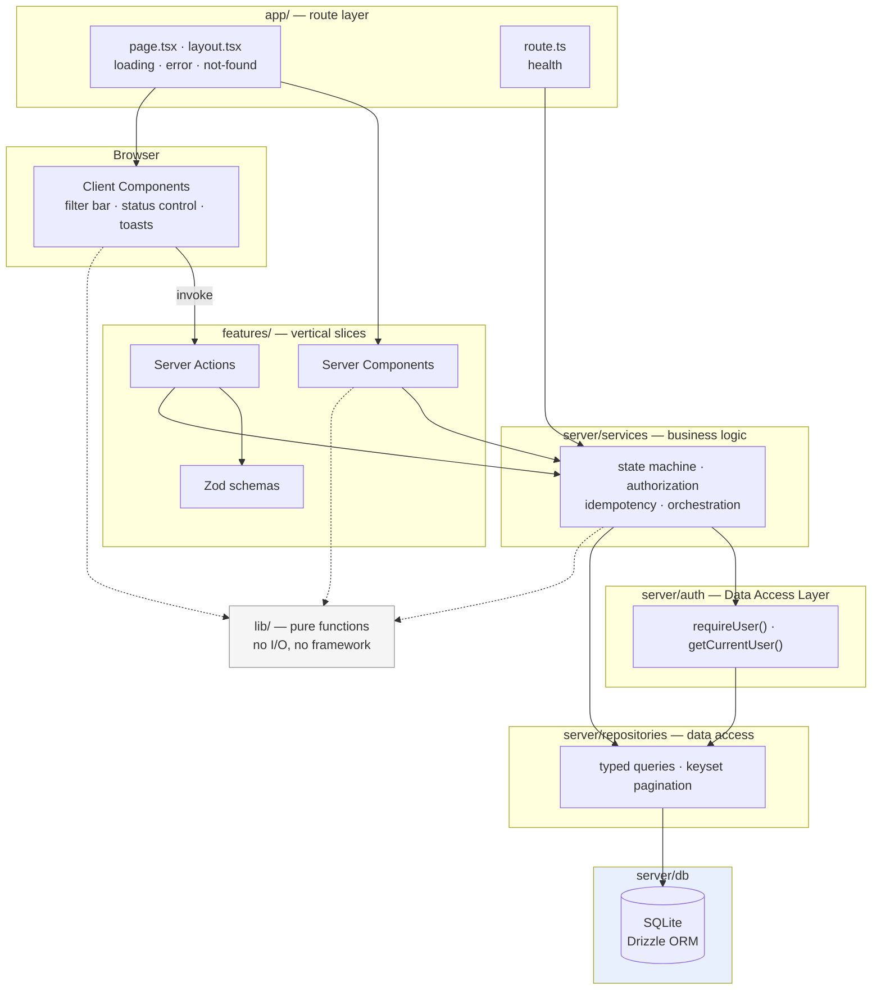
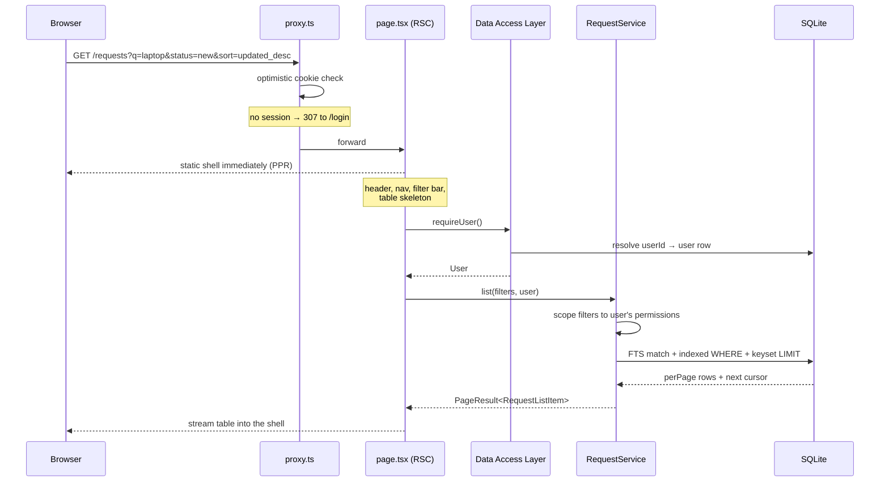
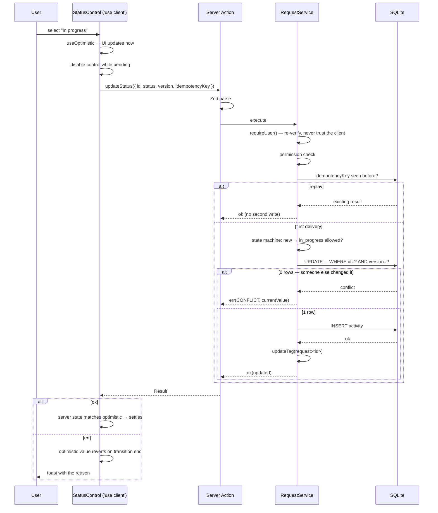

# 03 · System Architecture

## The governing idea

One rule explains most of the structure: **the route layer is thin, and authorization lives next to the data.**

Routes do nothing but read the URL, compose components, and place Suspense and error boundaries. They contain no business logic and no queries. Every read and write passes through a Data Access Layer that re-verifies the session itself, so no caller can forget to check. This follows the Data Access Layer pattern the Next.js authentication docs prescribe, and it is the reason a Server Action is as safe as a page: neither one trusts its caller.

## Layers



### The dependency rule

Dependencies point one way: **inward and downward, never back out.**

| Layer | May import from | Must never import from |
|---|---|---|
| `app/` | `features/`, `components/ui/`, `lib/` | `server/repositories`, `server/db` |
| `features/` | `server/services`, `components/ui/`, `lib/` | `app/`, `server/repositories`, `server/db` |
| `server/services` | `server/auth`, `server/repositories`, `lib/` | `app/`, `features/`, anything React |
| `server/repositories` | `server/db`, `lib/` | `app/`, `features/`, `server/services` |
| `lib/` | nothing (pure) | everything |

Two consequences worth naming. Routes cannot reach the database directly, so a query cannot be written inline in a page and escape the authorization check. And `lib/` importing nothing is what makes the activity-summary utility trivially unit-testable — it has no framework, no I/O, and no mocks.

This is enforced by `import/no-restricted-paths` in `eslint.config.mjs`, not by convention. Every file under `server/` also begins with `import 'server-only'`, so an accidental client import becomes a build error rather than a data leak.

## Folder structure

```
as-sunnah-desk/
├─ docs/                          # this folder
├─ drizzle/                       # generated migrations (committed)
├─ data/                          # app.db — gitignored
├─ src/
│  ├─ proxy.ts                    # replaces middleware.ts (Next 16)
│  │
│  ├─ app/
│  │  ├─ layout.tsx               # root: html/body, fonts, Toaster
│  │  ├─ globals.css
│  │  ├─ not-found.tsx
│  │  ├─ global-error.tsx
│  │  │
│  │  ├─ (auth)/
│  │  │  ├─ layout.tsx            # centred, minimal chrome
│  │  │  └─ login/page.tsx
│  │  │
│  │  ├─ (portal)/
│  │  │  ├─ layout.tsx            # app shell: nav, user menu
│  │  │  ├─ requests/
│  │  │  │  ├─ page.tsx           # dashboard
│  │  │  │  ├─ loading.tsx
│  │  │  │  ├─ error.tsx
│  │  │  │  └─ [id]/
│  │  │  │     ├─ page.tsx        # detail
│  │  │  │     ├─ loading.tsx
│  │  │  │     ├─ error.tsx
│  │  │  │     └─ not-found.tsx
│  │  │  └─ insights/page.tsx     # per-assignee summary
│  │  │
│  │  └─ api/
│  │     └─ health/route.ts
│  │
│  ├─ features/
│  │  ├─ auth/
│  │  │  ├─ actions/{login,logout}.ts
│  │  │  ├─ components/login-form.tsx
│  │  │  └─ schemas/credentials.ts
│  │  ├─ requests/
│  │  │  ├─ request-columns.ts           # shared column defs (table + mobile cards)
│  │  │  ├─ actions/{update-status,update-assignee}.ts
│  │  │  ├─ components/
│  │  │  │  ├─ request-table.tsx          # Server Component
│  │  │  │  ├─ request-table-skeleton.tsx
│  │  │  │  ├─ request-row.tsx            # Server Component
│  │  │  │  ├─ filter-bar.tsx             # 'use client'
│  │  │  │  ├─ search-input.tsx           # 'use client', debounced
│  │  │  │  ├─ status-control.tsx         # 'use client', optimistic
│  │  │  │  ├─ assignee-control.tsx       # 'use client', optimistic
│  │  │  │  ├─ pagination.tsx
│  │  │  │  └─ empty-state.tsx
│  │  │  └─ schemas/update.ts
│  │  └─ activity/
│  │     └─ components/activity-timeline.tsx
│  │
│  ├─ server/
│  │  ├─ db/
│  │  │  ├─ client.ts             # libSQL + Drizzle singleton
│  │  │  ├─ schema.ts             # tables, indexes, FTS
│  │  │  ├─ seed.ts               # 12,000 requests
│  │  │  └─ types.ts              # inferred row/insert types
│  │  ├─ repositories/
│  │  │  ├─ request.repository.ts
│  │  │  ├─ activity.repository.ts
│  │  │  ├─ user.repository.ts
│  │  │  └─ reference.repository.ts
│  │  ├─ services/
│  │  │  ├─ request.service.ts
│  │  │  ├─ request-status.machine.ts
│  │  │  └─ idempotency.ts
│  │  ├─ auth/
│  │  │  ├─ session.ts            # iron-session seal/unseal
│  │  │  ├─ dal.ts                # getCurrentUser, requireUser
│  │  │  ├─ password.ts           # argon2
│  │  │  ├─ permissions.ts        # role capability map
│  │  │  └─ rate-limit.ts
│  │  ├─ cache/tags.ts            # centralised cacheTag names
│  │  ├─ errors/app-error.ts
│  │  └─ env.ts                   # Zod-parsed environment
│  │
│  ├─ lib/
│  │  ├─ summarize-activity/      # the advanced-JS utility
│  │  ├─ result.ts                # Result<T, E>
│  │  ├─ hooks/
│  │  │  └─ use-debounced-callback.ts
│  │  ├─ search-params/           # URL contract (Zod schema, categories.ts, parse, serialise, cursor)
│  │  └─ format/{date,text}.ts
│  │
│  ├─ components/ui/              # shadcn/ui on Base UI — see docs/14-ui-component-plan.md
│  └─ test/{setup.ts,factories/,e2e/}
│
├─ .cursor/rules/                 # token-optimised agent rules
├─ .vscode/                       # format-on-save, recommended extensions
├─ lefthook.yml
├─ prettier.config.mjs
├─ knip.json
├─ .editorconfig
├─ eslint.config.mjs
├─ drizzle.config.ts
├─ vitest.config.ts
├─ playwright.config.ts
└─ next.config.ts
```

Two structural notes. `src/` is adopted so application code is separated from configuration; per the Next.js `src-folder` docs, `proxy.ts` must then live inside `src/` while `public/`, `.env*` and the config files stay at the repository root. And features are organised as **vertical slices** — a feature's actions, components and schemas sit together — because changes arrive by feature, not by technical layer. A horizontal `components/ / hooks/ / utils/` split would scatter each change across four directories.

## The two request lifecycles

### Reading the dashboard



The shape to notice: the shell is sent before authorization completes. The session read happens inside a Suspense boundary, so the user sees chrome and a skeleton immediately rather than a blank page. Under Cache Components this is not an optimisation to add later — reading `cookies()` outside a boundary is a build error, so the framework requires the structure that produces it.

### Updating a status



Each guard answers a different failure. `disabled` handles the impatient double-click; the idempotency key handles retries and duplicate delivery, which `disabled` cannot; the version check handles a second user, which neither of the others can. [07 · Mutations](./07-mutations-and-client-state.md) covers the implementation.

## The server/client boundary

Placement is deliberate, and the default is server.

| Component | Environment | Why |
|---|---|---|
| `requests/page.tsx` | Server | Reads `searchParams`, orchestrates |
| `request-table.tsx` | Server | Pure rendering of a fetched page |
| `request-row.tsx` | Server | No interactivity of its own |
| `activity-timeline.tsx` | Server | Read-only history |
| `filter-bar.tsx` | **Client** | Controlled filter inputs; commits to URL immediately |
| `search-input.tsx` | **Client** | `useDebouncedCallback` (300 ms) + `useTransition` |
| `status-control.tsx` | **Client** | `useOptimistic`, `useTransition` |
| `assignee-control.tsx` | **Client** | Combobox, virtualised list |
| `pagination.tsx` | Server | `<Link>` only; needs no JS |
| `login-form.tsx` | **Client** | `useActionState` for field errors |
| `<Toaster />` | **Client** | Imperative notification host |

The rule applied throughout: `'use client'` marks a **boundary**, not a component. Everything a client file imports joins the client bundle, so the directive goes on the smallest leaf that needs it. Pagination is the clearest illustration — it is navigation, so it is anchors, so it costs nothing and works with JavaScript disabled.

The row status control is the interesting case. The row is a Server Component, and only the control inside it is a client island. At 100 rows that is 100 small islands over server-rendered markup, rather than a client-rendered table.

## Error handling architecture

Three distinct mechanisms, because they answer three distinct questions.

**1. Expected failures are return values.** Validation errors, conflicts, and permission denials are not exceptional — they are outcomes. Services and actions return a `Result`:

```ts
// lib/result.ts
export type Result<T, E = AppError> =
  | { readonly ok: true; readonly data: T }
  | { readonly ok: false; readonly error: E }
```

This follows the Next.js guidance that expected errors should be returned rather than thrown, and it makes the failure modes visible in the type signature. A caller cannot forget to handle a conflict, because the type will not let them reach `data` without narrowing.

**2. Unexpected failures throw and hit a boundary.** A database being unreachable is a bug or an outage, not a user outcome. It throws, and the nearest `error.tsx` catches it and offers `retry()`. Boundaries are per route segment so a failing activity timeline does not take down the request details beside it.

**3. Framework interrupts use framework functions.** A missing request calls `notFound()`. An unauthenticated user gets `redirect('/login')` from the DAL. These throw control-flow signals and must not be wrapped in `try/catch`.

One consequence of Partial Prerendering worth stating explicitly, because it is a real constraint rather than a detail: once the static shell has started streaming, the HTTP status is already 200 and cannot be changed. So `notFound()` inside a Suspense boundary renders the not-found *UI* but the response is still 200. When a genuine 404 status code matters — for crawlers, or for an API consumer — the check has to happen in `proxy.ts` before streaming begins. This design accepts 200-with-not-found-UI for the request detail page (it is behind authentication and not crawlable) and documents the trade-off rather than pretending it does not exist.

## Naming conventions

| Kind | Convention | Example |
|---|---|---|
| Files | `kebab-case` | `request-table.tsx` |
| Repository / service files | `*.repository.ts`, `*.service.ts` | `request.repository.ts` |
| Components, types | `PascalCase` | `RequestTable`, `RequestListItem` |
| Functions, variables | `camelCase` | `listRequests` |
| Zod schemas | `*Schema` with inferred type | `updateStatusSchema` → `UpdateStatusInput` |
| Server Actions | imperative verb | `updateStatus`, `login` |
| Repository reads | `find*` returns nullable, `list*` returns a page | `findByReference`, `findById`, `listPaged` |
| Cache tags | `entity:id` via `server/cache/tags.ts` | `request:142` |
| Booleans | `is` / `has` / `can` prefix | `canAssign` |

Cache tags are centralised in one module rather than written as string literals at call sites. A typo in a tag name is invisible at runtime — the write succeeds and the cache is simply never invalidated — which makes it exactly the kind of bug worth designing out.
