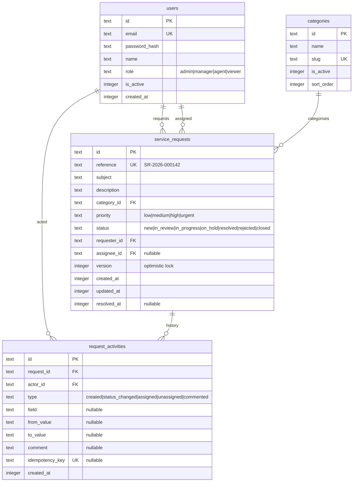
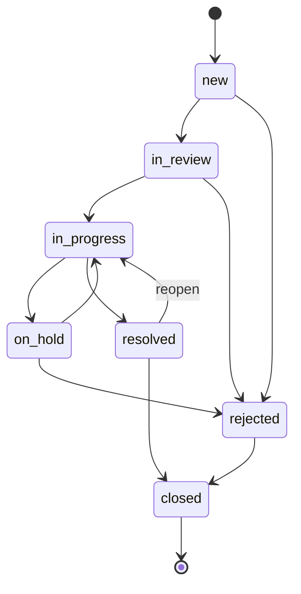

# 04 · Data Model and Scale

The brief says "assume 10,000+ requests". The honest reading is not "make it survive 10,000 rows" but "make the cost of a page view independent of the table size". Everything below follows from that.

## Entity model



### Field decisions worth explaining

**`reference` separate from `id`.** The primary key is a surrogate (UUIDv7), while `reference` is the human identifier shown in the UI (`SR-2026-000142`). The dashboard's "ID" column shows `reference`. Users quote it in emails; it must be stable, readable, and independent of storage concerns. Exposing a raw UUID as "the ID" would be a usability failure, and exposing a sequential integer primary key leaks row counts.

**UUIDv7 rather than UUIDv4.** v7 is time-ordered, so inserts stay at the end of the B-tree index instead of scattering across it, and the key itself sorts chronologically. With v4 the index fragments and every insert is a random write.

**Timestamps as integers.** SQLite has no native date type. Unix milliseconds as `INTEGER` sort correctly, index correctly, and compare without parsing. Drizzle's `integer('created_at', { mode: 'timestamp_ms' })` gives `Date` objects in TypeScript, so the storage representation never leaks into application code.

**`version` on `service_requests`.** An integer incremented on every write, and the basis for optimistic concurrency control. Without it, two people editing the same request silently overwrite each other — the classic lost update. See [07 · Mutations](./07-mutations-and-client-state.md#optimistic-concurrency).

**`resolved_at` stored, not derived.** The activity-summary utility needs resolution duration. Deriving it by scanning activity history per request would make the summary O(n·m); storing it at the moment of transition makes the read trivial. It is denormalised on purpose, written only by the status transition to `resolved`.

**`assignee_id` nullable, and "unassigned" is a real state.** Unassigned requests are the ones that need attention most, so filtering for them is a first-class feature rather than an absence. The URL contract accepts `assignee=unassigned`, which the repository translates to `IS NULL`.

**`slug` on categories, for readable filter URLs.** Categories have an internal `id` (FK on `service_requests.category_id`) and a unique `slug` (`it-support`, `hr`, …). Filter URLs use **slugs** so `?category=it-support` is meaningful; `RequestService` maps slugs → ids before the repository runs SQL. Assignee filters use opaque user ids (`user_admin`) because there is no equally readable alternative. Request detail URLs use `reference` for the same reason. See [URL filter identifiers](#url-filter-identifiers).

**`idempotency_key` on activities.** A unique index here is what makes a replayed mutation a no-op. Putting it on the activity rather than a separate table means the deduplication record and the audit record are the same row, and cannot diverge.

## Status state machine

"Allow status updates" without constraints is not a workflow. Transitions are explicit:



Encoded as data, not as branching logic:

```ts
// server/services/request-status.machine.ts
export const STATUS_TRANSITIONS = {
  new:         ['in_review', 'rejected'],
  in_review:   ['in_progress', 'rejected'],
  in_progress: ['on_hold', 'resolved'],
  on_hold:     ['in_progress', 'rejected'],
  resolved:    ['closed', 'in_progress'],
  rejected:    ['closed'],
  closed:      [],
} as const satisfies Record<RequestStatus, readonly RequestStatus[]>

export function canTransition(from: RequestStatus, to: RequestStatus): boolean {
  return (STATUS_TRANSITIONS[from] as readonly RequestStatus[]).includes(to)
}
```

Two benefits beyond validation. The UI can derive its options from the same table, so a user is never offered a transition the server will reject — the invalid state is unreachable rather than merely rejected. And the machine is a pure function, so it is exhaustively unit tested in microseconds.

`closed` being terminal is a deliberate product decision, and the kind of thing worth surfacing for review rather than burying.

## Indexing strategy

Indexes exist to serve specific queries. Each one here is justified by a query the UI actually issues:

```ts
// server/db/schema.ts — index definitions
index('idx_requests_updated').on(t.updatedAt, t.id),                    // default sort
index('idx_requests_status_updated').on(t.status, t.updatedAt, t.id),   // status filter
index('idx_requests_assignee_status').on(t.assigneeId, t.status, t.updatedAt),
index('idx_requests_priority_updated').on(t.priority, t.updatedAt, t.id),
index('idx_requests_category_updated').on(t.categoryId, t.updatedAt, t.id),
index('idx_activities_request').on(t.requestId, t.createdAt),
uniqueIndex('idx_activities_idem').on(t.idempotencyKey),
```

Every sort index ends with `id`. That is not decoration — keyset pagination compares the tuple `(sortKey, id)`, and including `id` in the index lets the whole comparison be satisfied by an index seek. Without it, ties on `updated_at` force a sort.

The `(assignee_id, status, updated_at)` composite serves the most common real query in a tool like this: "my open requests". Column order follows selectivity — equality predicates first, range/sort column last.

Full-text search is a separate FTS5 virtual table kept in sync by triggers:

```sql
CREATE VIRTUAL TABLE requests_fts USING fts5(
  reference, subject, description,
  content='service_requests', content_rowid='rowid',
  tokenize='porter unicode61'
);
```

This is the difference between a search that stays fast and one that does not. `LIKE '%laptop%'` cannot use an index and degrades linearly with table size; an FTS5 `MATCH` is an inverted-index lookup. Porter stemming also means "requesting" matches "request", which users expect.

Verification is part of the definition of done: `EXPLAIN QUERY PLAN` output for the list query is captured in the test suite, and a plan containing `SCAN service_requests` fails the test. A performance claim that is not asserted will regress.

## Pagination

This is where a dashboard at 10,000 rows usually goes wrong.

`LIMIT 25 OFFSET 9800` requires the database to produce and discard 9,800 rows. The cost grows with page depth, so the last page is the slowest — precisely backwards from what users expect. Offset pagination also has a correctness flaw: if a row is inserted while someone pages, rows shift and an item can be seen twice or skipped entirely.

> **Decision — keyset (cursor) pagination as the primary mechanism.**

The cursor encodes the sort tuple of the last row seen:

```ts
// lib/search-params/cursor.ts
type Cursor = { readonly sortValue: string | number; readonly id: string }

// Encoded as URL-safe base64. Opaque to the client by design —
// an opaque cursor cannot be hand-edited into an unintended query.
```

The query becomes a seek rather than a scan:

```sql
SELECT ... FROM service_requests
WHERE (updated_at, id) < (:cursorUpdatedAt, :cursorId)   -- forward, desc
  AND status IN (...) AND priority IN (...)
ORDER BY updated_at DESC, id DESC
LIMIT 26;                          -- 26 to detect "has next page"
```

Cost is O(log n) at any depth: page 400 is as fast as page 1. Fetching `limit + 1` rows is how "is there a next page" is answered without a second query.

**The honest trade-off.** Keyset pagination gives Next and Previous, not "jump to page 47". For a work queue that is the right shape — nobody navigates to page 47 of a request list; they filter. But because the brief explicitly asks for pagination, the UI also offers bounded page numbers for the first 20 pages, where `OFFSET` is still cheap, and falls back to cursor-only navigation beyond that. Both modes are representable in the URL.

### Counting

`SELECT COUNT(*)` with filters is a full scan of the matching set. On every page load, for a number most users only glance at, that is a poor trade.

```ts
// Count at most CAP + 1 rows, then report honestly.
const CAP = 1_000
// "247 requests"  → exact
// "1,000+ requests" → capped; the exact number is not worth the scan
```

Facet counts (how many requests per status) are a different case: low cardinality, identical for all users, and genuinely useful. They are cached with `use cache` and `cacheLife('minutes')` and tagged so a mutation refreshes them.

## URL filter identifiers

What each filter param carries in the URL vs what reaches SQL:

| Filter | URL param | Example | Resolved to (SQL) |
|---|---|---|---|
| Category | `category` | `it-support` | `categories.id` → `service_requests.category_id` |
| Assignee | `assignee` | `user_admin`, `unassigned` | `users.id` or `IS NULL` |
| Status / priority | same enum as DB | `new`, `urgent` | column value directly |
| Request detail segment | `[id]` | `SR-2026-000142` | `service_requests.reference` |

Slug → id resolution happens in `RequestService` using the cached category list from `reference.repository`. Unknown slugs are stripped during `normalise()`; the repository only ever receives `categoryIds: string[]`.

```ts
// server/services/request.service.ts (before repository call)
const categoryIds = resolveCategoryIds(parsed.category, categories)
```

Fixed seed slugs: [15 · Local setup](./15-local-setup.md#seeded-categories).

## Query shape

The list query composes from filters without string concatenation. **Category slugs are already resolved to ids** — the repository works in database terms only:

```ts
// server/repositories/request.repository.ts
export async function listPaged(
  filters: RequestFilters,
  cursor: Cursor | null,
  limit: number,
): Promise<PageResult<RequestListItem>> {
  const where = [
    filters.statuses.length ? inArray(requests.status, filters.statuses) : undefined,
    filters.priorities.length ? inArray(requests.priority, filters.priorities) : undefined,
    filters.categoryIds.length ? inArray(requests.categoryId, filters.categoryIds) : undefined,
    filters.assigneeIds.length ? assigneePredicate(filters.assigneeIds) : undefined,
    filters.query ? inArray(requests.id, ftsMatchSubquery(filters.query)) : undefined,
    cursor ? keysetPredicate(filters.sort, cursor) : undefined,
  ].filter(Boolean)

  // ... orderBy from the whitelisted sort map, limit + 1
}
```

Three properties matter here. Filters are `undefined` when absent and filtered out, so an unfiltered query carries no dead predicates. `inArray` produces bound parameters, so the query is parameterised and SQL injection is structurally impossible. And `sort` is mapped through a whitelist — a URL value never reaches SQL as a column name:

```ts
const SORT_COLUMNS = {
  updated_desc:  { column: requests.updatedAt, direction: 'desc' },
  updated_asc:   { column: requests.updatedAt, direction: 'asc' },
  created_desc:  { column: requests.createdAt, direction: 'desc' },
  priority_desc: { column: requests.priorityRank, direction: 'desc' },
} as const
```

`priority_rank` is a stored generated column mapping `urgent → 4 … low → 1`, because sorting the text values alphabetically would order them `high, low, medium, urgent` — nonsense, and an easy bug to ship.

### Projection

The list query selects only the eleven columns the table renders. `description` is deliberately excluded — it is the largest column, and it is not displayed in the list. Selecting it would multiply the payload for data that is thrown away.

This is also a security boundary. Repositories return narrow, explicitly shaped types (the DTO pattern from the Next.js data-security guide) rather than whole rows. A row spread into a Server Component prop lands in the RSC payload and reaches the browser, so `password_hash` must never be in a returned object in the first place.

## Seeding

`pnpm db:seed` generates a realistic dataset:

| Table | Rows | Notes |
|---|---|---|
| `users` | 60 | 4 fixed credentialed accounts (one per role) + 56 generated — emails and passwords in [15 · Local setup](./15-local-setup.md#seeded-test-accounts) |
| `categories` | 12 | Fixed rows — slugs in URL, ids as FK. Full list: [15 · Seeded categories](./15-local-setup.md#seeded-categories) |
| `service_requests` | 12,000 | Above the stated threshold, deliberately |
| `request_activities` | ~48,000 | 2–8 per request, chronologically consistent |

Realism matters more than volume. The distribution is skewed the way real queues are — most requests `new` or `in_progress`, few `closed`; priority weighted toward `medium`; `created_at` spread over 18 months with weekday clustering; about 15% unassigned; resolution times log-normal rather than uniform. A uniformly random dataset would make every filter return roughly the same count and would hide the index behaviour the design is meant to demonstrate.

The seed is deterministic — a fixed faker seed — so the database is reproducible, and E2E tests can assert against known records instead of whatever was generated that morning.

Insertion is batched inside a single transaction, and the FTS index is populated after the bulk insert rather than per row, which is the difference between a seed that takes seconds and one that takes minutes.

## Where this breaks, and what changes

Worth stating so the boundaries of the design are explicit rather than assumed:

| Scale | Status | Change required |
|---|---|---|
| 10k–100k | Works as designed | None |
| ~1M | Works, counts get coarser | Lower the count cap; add covering indexes for the hot filter combinations |
| 10M+ | SQLite becomes the limit | Swap the driver to PostgreSQL. Only `server/db/client.ts` and the FTS implementation (→ `tsvector`) change; repositories keep their signatures |
| Concurrent writers | SQLite serialises writes | This portal is read-heavy with occasional single-record updates, so it is not a constraint here. It would be for bulk operations |

The repository interface is the seam that makes the PostgreSQL swap a contained change rather than a rewrite. That is the main reason services talk to repositories and never to Drizzle directly.
