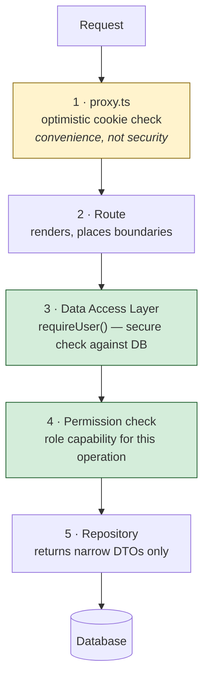

# 06 · Auth and Security

## The principle

**Authorization belongs next to the data, not next to the route.**

A page-level check protects a page. It does not protect the Server Actions that page renders, and it does not protect a Route Handler. Server Actions are reachable by direct `POST` even when nothing in the UI links to them — the framework documents this explicitly — so each one must authorize itself.

Everything below follows from taking that seriously.

## Defence layers



Layer 1 is yellow for a reason. `proxy.ts` is a redirect convenience; it is never the boundary that protects data. Layers 3 and 4 are the ones that do, and they run on every read and every write.

## Sessions

The session is an encrypted, sealed cookie containing only a user id and expiry:

```ts
// server/auth/session.ts
import 'server-only'
import { cookies } from 'next/headers'
import { sealData, unsealData } from 'iron-session'
import { env } from '@/server/env'

const COOKIE_NAME = 'asf_session'
const TTL_MS = 7 * 24 * 60 * 60 * 1000

export type SessionData = { userId?: string }

export async function getSession(): Promise<SessionData> {
  const cookie = (await cookies()).get(COOKIE_NAME)?.value
  if (!cookie) return {}
  try {
    return await unsealData<SessionData>(cookie, { password: env.SESSION_PASSWORD })
  } catch {
    return {} // tampered or expired seal — treat as anonymous
  }
}

export async function createSession(userId: string): Promise<void> {
  const expiresAt = new Date(Date.now() + TTL_MS)
  const sealed = await sealData({ userId }, { password: env.SESSION_PASSWORD })
  const cookieStore = await cookies()

  cookieStore.set(COOKIE_NAME, sealed, {
    httpOnly: true, // unreadable from JS → XSS cannot exfiltrate
    secure: process.env.NODE_ENV === 'production', // false on localhost or dev login breaks
    sameSite: 'lax', // CSRF resistance, survives top-level navigation
    expires: expiresAt,
    path: '/',
  })
}

export async function deleteSession(): Promise<void> {
  ;(await cookies()).delete(COOKIE_NAME)
}
```

Each cookie option earns its place. `httpOnly` means an XSS bug cannot steal the session. `sameSite: 'lax'` blocks cross-site `POST` while still allowing a normal link into the app to stay logged in; `strict` would log users out when they follow a link from an email. `secure` is conditional because an unconditional `secure: true` silently breaks login on `http://localhost` — a genuinely common and confusing failure.

Note `cookies()` is async in Next.js 16, with no synchronous fallback, and `.set()`/`.delete()` are only legal in Server Actions and Route Handlers — never during a Server Component render.

**Why the cookie holds only an id.** Encrypted cookies can hold more, but every field stored becomes a field that can be stale. A role in the cookie means a demoted user keeps their old permissions until the cookie expires. The id alone forces a database lookup, which is always current.

**Trade-off:** stateless sessions cannot be revoked server-side before expiry. Signing out clears the cookie on that device only. Accepted for this scope, and the upgrade path is explicit: a `sessions` table with the id stored in the cookie makes revocation a single `DELETE`. Because every read already goes through `requireUser()`, that change touches one function.

## The Data Access Layer

This is the security boundary. Every read and write passes through it, so the check cannot be forgotten.

```ts
// server/auth/dal.ts
import 'server-only'
import { cacheLife } from 'next/cache'
import { redirect } from 'next/navigation'
import { getSession } from './session'
import { findActiveUserById } from '@/server/repositories/user.repository'

export type AuthenticatedUser = {
  readonly id: string
  readonly name: string
  readonly email: string
  readonly role: Role
}

/** Resolves the session to a live user. Redirects if absent or deactivated. */
export async function getCurrentUser(): Promise<AuthenticatedUser> {
  'use cache: private'
  cacheLife('minutes')

  const { userId } = await getSession()
  if (!userId) redirect('/login')

  const user = await findActiveUserById(userId)
  if (!user) redirect('/login') // deleted or deactivated since the cookie was issued

  return { id: user.id, name: user.name, email: user.email, role: user.role }
}

/** For Server Actions and Route Handlers, which must not redirect mid-mutation. */
export async function requireUser(): Promise<Result<AuthenticatedUser>> {
  const { userId } = await getSession()
  if (!userId) return err({ code: 'UNAUTHENTICATED' })

  const user = await findActiveUserById(userId)
  if (!user) return err({ code: 'UNAUTHENTICATED' })

  return ok({ id: user.id, name: user.name, email: user.email, role: user.role })
}
```

Two functions rather than one, because the correct failure behaviour differs by caller. A page should redirect to login — that is the useful outcome. A Server Action should return a structured error the client can render, because redirecting in the middle of a mutation loses the user's context and tells them nothing.

Both perform a **secure check**: the id is resolved against the database, so `is_active = 0` revokes access on the next request. The docs distinguish this from an _optimistic_ check (trusting cookie contents), which is all `proxy.ts` is allowed to do.

`findActiveUserById` is wrapped in `React.cache()`, so several callers in one render share one query.

The returned object is a narrow DTO, never the row. This matters concretely: `password_hash` is a column on `users`, and any object returned from a Server Component reaches the browser in the RSC payload. The only reliable defence is never putting it in the object.

## Authorization

A signed-in user can review every request and update status and assignee. The brief does not ask for separate roles, so there is no capability matrix. `requireUser()` is the check on every Server Action. Pages call `getCurrentUser()`, which redirects when the session is missing. Hiding a control is not the security boundary; the action re-checks the session.

## Server Actions as public endpoints

The framework provides real protections, and it is worth knowing which ones are automatic:

| Protection                                     | Automatic?                            |
| ---------------------------------------------- | ------------------------------------- |
| `POST`-only invocation                         | Yes                                   |
| CSRF check comparing `Origin` against `Host`   | Yes                                   |
| Encrypted, non-deterministic action IDs        | Yes                                   |
| Unused actions stripped from the client bundle | Yes                                   |
| 1 MB request body limit                        | Yes (configurable)                    |
| **Authentication and authorization**           | **No — application's responsibility** |
| **Input validation**                           | **No — application's responsibility** |
| **Constraining return values**                 | **No — application's responsibility** |

Every action in this application therefore follows the same four-step preamble, in this order:

```ts
'use server'

export async function updateStatus(input: unknown): Promise<Result<RequestSummary>> {
  // 1. Validate — treat every argument as untrusted
  const parsed = updateStatusSchema.safeParse(input)
  if (!parsed.success) {
    return err({ code: 'VALIDATION', fields: parsed.error.flatten().fieldErrors })
  }

  // 2. Authenticate — never trust a client-supplied user id
  const auth = await requireUser()
  if (!auth.ok) return auth

  // 3. Authorize — this user, this capability
  if (!can(auth.data, 'request:update:status')) {
    return err({ code: 'FORBIDDEN' })
  }

  // 4. Execute — the service owns the state machine, idempotency and concurrency
  return requestService.updateStatus(auth.data, parsed.data)
}
```

The ordering is deliberate: validate before authenticating so a malformed payload never touches the session, and authorize before executing so no work happens for a user who may not do it.

The identity always comes from the session, never from the payload. A client-supplied `actorId` would be the whole vulnerability.

Return values are `Result` objects carrying only what the UI renders. Action returns are serialised to the client, so an internal error object with a stack trace or a SQL fragment would be shipped to the browser.

## The proxy layer

```ts
// src/proxy.ts   (renamed from middleware.ts in Next.js 16)
import { NextResponse, type NextRequest } from 'next/server'
import { unsealData } from 'iron-session'

const PUBLIC_PATHS = new Set(['/login'])

export async function proxy(request: NextRequest) {
  const { pathname } = request.nextUrl
  const sealed = request.cookies.get('asf_session')?.value

  // Optimistic only: does a plausible session cookie exist?
  // No database access here — proxy runs on every request including prefetches.
  let hasSession = false
  if (sealed) {
    try {
      const data = await unsealData<{ userId?: string }>(sealed, {
        password: process.env.SESSION_PASSWORD!,
      })
      hasSession = Boolean(data.userId)
    } catch {
      hasSession = false
    }
  }

  if (!hasSession && !PUBLIC_PATHS.has(pathname)) {
    const url = request.nextUrl.clone()
    url.pathname = '/login'
    url.searchParams.set('next', pathname) // return the user where they were going
    return NextResponse.redirect(url)
  }

  if (hasSession && pathname === '/login') {
    return NextResponse.redirect(new URL('/requests', request.url))
  }

  return NextResponse.next()
}

export const config = {
  matcher: ['/((?!api/health|_next/static|_next/image|favicon.ico).*)'],
}
```

Next.js 16 specifics: the file is `proxy.ts` (at `src/proxy.ts` when using a `src/` directory), the exported function is `proxy`, and the runtime is Node.js and cannot be configured — the Edge runtime is not supported here.

**No database call in the proxy.** It runs on every request including prefetches, so a query here would multiply database load by the prefetch count. The cookie check is all it does.

**The `next` parameter** is a small thing that matters: a user deep-linked to a request who gets bounced to login should land back on that request, not on a generic dashboard.

**One matcher hazard worth naming.** Server Actions are `POST` requests to their own route, so a matcher that excludes a path also excludes proxy coverage for actions on that path. This is precisely why the proxy is not load-bearing for security — if it were, a matcher edit could silently unprotect mutations. The DAL closes that gap.

## Content Security Policy

Here the design meets a real conflict, and the honest thing is to name it.

The documented nonce-based CSP for Next.js generates a per-request nonce in the proxy and passes it via an `x-nonce` header. But it **requires dynamic rendering** — it disables static generation and CDN caching, and the docs state it is **incompatible with PPR**. Since `cacheComponents: true` makes PPR the default, nonce CSP and this design's rendering model are mutually exclusive.

> **Decision — a strict static CSP without per-request nonces, and keep PPR.**
>
> For an authenticated internal tool, instant navigation on every page is a benefit users feel continuously. Nonce-based `script-src` defends primarily against injected inline scripts — a risk already addressed here at its source: React escapes interpolated content by default, there is no `dangerouslySetInnerHTML` anywhere in the codebase, there are no inline event handlers, and all user-supplied text renders as text nodes.
>
> **Rejected:** dropping `cacheComponents` to gain nonce CSP. That trades a continuous, measurable performance benefit for defence-in-depth against a vector the application does not expose. Also rejected: `experimental.sri` hash-based CSP, which would give a strict policy without nonces but is experimental and not a sensible dependency for this deliverable.
>
> **Trade-off, stated plainly:** `script-src` must permit the framework's inline bootstrap scripts, so it is not as strict as a nonce policy would be. If this were a public, unauthenticated, user-generated-content application, the decision would go the other way.

Everything that does not need a nonce is still locked down, via static headers:

```ts
// next.config.ts
const securityHeaders = [
  { key: 'X-Content-Type-Options', value: 'nosniff' },
  { key: 'Referrer-Policy', value: 'strict-origin-when-cross-origin' },
  { key: 'X-Frame-Options', value: 'DENY' },
  { key: 'Permissions-Policy', value: 'camera=(), microphone=(), geolocation=()' },
  { key: 'Strict-Transport-Security', value: 'max-age=63072000; includeSubDomains; preload' },
  {
    key: 'Content-Security-Policy',
    value: [
      "default-src 'self'",
      "script-src 'self' 'unsafe-inline'", // see trade-off above
      "style-src 'self' 'unsafe-inline'", // Tailwind injects styles
      "img-src 'self' data: blob:",
      "font-src 'self'",
      "connect-src 'self'",
      "object-src 'none'",
      "base-uri 'self'",
      "form-action 'self'",
      "frame-ancestors 'none'",
      'upgrade-insecure-requests',
    ].join('; '),
  },
]
```

`frame-ancestors 'none'` and `object-src 'none'` close clickjacking and plugin-injection. `form-action 'self'` prevents a form being retargeted to an attacker's origin.

## Login rate limiting

Without throttling, a login form is an offline-speed password oracle. Argon2 makes each attempt expensive, but expensive is not the same as limited.

```ts
// server/auth/rate-limit.ts — in-memory sliding window, no external service
const WINDOW_MS = 15 * 60 * 1000
const MAX_ATTEMPTS = 5

export function checkLoginAttempt(key: string): { allowed: boolean; retryAfterMs: number }
```

Keyed on a hash of `IP + email` so one attacker cannot lock out an entire shared-NAT office, and one target account cannot be attacked from many IPs without tripping the per-account counter.

**Trade-off:** in-memory state is per-process and resets on restart, so it does not survive horizontal scaling. That is correct for this deliverable — the brief requires no paid external service, and a Redis dependency would violate it. The seam is a single function, so swapping to Redis or Upstash is a one-file change in production.

The login action also **always** runs a password verification, even when the email does not exist, comparing against a dummy hash. Skipping the hash on unknown emails creates a timing difference that enumerates valid accounts. For the same reason the error message is always "Invalid email or password" — never "no such user".

## Data security practices

| Practice                 | Implementation                                                                                                      |
| ------------------------ | ------------------------------------------------------------------------------------------------------------------- |
| Server-only isolation    | Every file under `server/` starts with `import 'server-only'`. A client import becomes a build error, not a leak    |
| Narrow DTOs              | Repositories select explicit columns. `password_hash` never leaves the repository                                   |
| Environment validation   | `server/env.ts` Zod-parses at startup. A missing `SESSION_PASSWORD` fails immediately, not at first login           |
| No secrets in cache keys | Cache keys and `cacheTag` values are stored in **plain text**, unhashed. Tags key on ids, never on emails or tokens |
| Parameterised queries    | Drizzle binds all parameters. No string-built SQL anywhere                                                          |
| Sort whitelist           | URL `sort` maps through a `const` object to a column reference. A URL value never becomes a column name             |
| Opaque cursors           | Base64-encoded, so pagination state cannot be hand-edited into an unintended query                                  |
| Generic auth errors      | No distinction between unknown email and wrong password                                                             |

The plain-text cache key point deserves emphasis because it is easy to get wrong and invisible when you do: `cacheTag` values and cached function arguments are stored as written, in both the default in-memory cache and any remote cache handler. Keying a cached function on a user's email address writes that email into a cache index in clear text. Keying on the user id does not.

## What is deliberately not implemented

- **`forbidden()` and `unauthorized()`** with their `forbidden.tsx` / `unauthorized.tsx` conventions. These exist in Next.js 16 but require `experimental.authInterrupts: true`. An experimental flag is the wrong dependency for a deliverable, so authorization failures return `Result` errors and render inline instead. Worth knowing they exist — they are the clean answer once stable.
- **Taint APIs** (`experimental_taintObjectReference`, `experimental.taint`). Useful defence-in-depth, but they track by reference and do not follow copies or derived values, so they supplement narrow DTOs rather than replacing them. The DTO discipline is the actual protection, and it is already in place.
- **Database-backed sessions.** Covered above; the upgrade path is one function.
- **Two-factor authentication and password reset.** Outside the brief's "simple login/logout flow", and password reset in particular requires email delivery, which would mean an external service.

## Related documents

| Document                                                              | Relationship                                                                      |
| --------------------------------------------------------------------- | --------------------------------------------------------------------------------- |
| [18 · Security guidelines](./18-security-guidelines.md)               | Engineering checklist: API entry points, Route Handlers, PR review, anti-patterns |
| [07 · Mutations and client state](./07-mutations-and-client-state.md) | Idempotency, optimistic concurrency, state machine                                |
| [16 · Test guidelines](./16-test-guidelines.md)                       | How to write auth and IDOR integration tests                                      |
