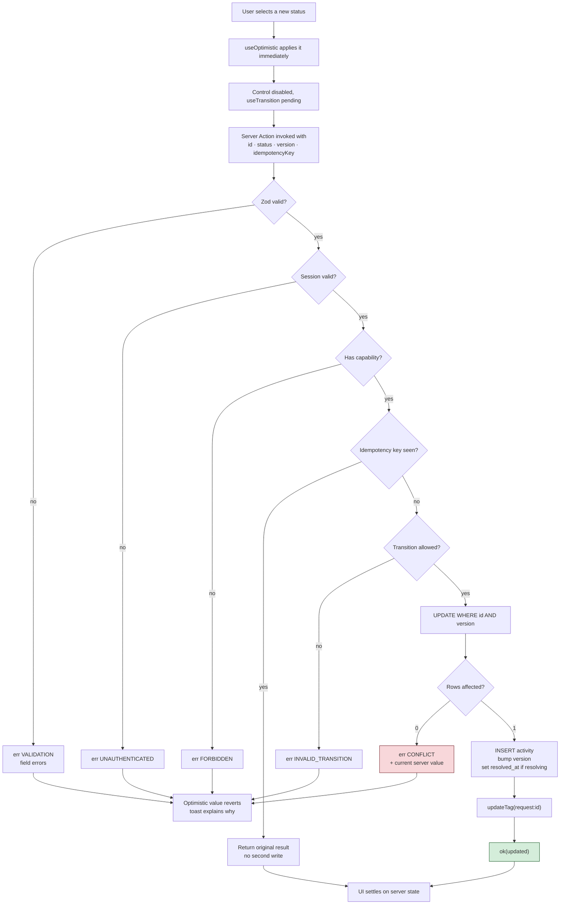

# 07 · Mutations and Client State

The brief asks for updates with "immediate user feedback, prevent duplicate actions and handle API latency/failure gracefully, including rollback where appropriate." Each clause is a different failure mode with a different mechanism. This document works through them, then covers where client state lives.

## Four failure modes, four mechanisms

It is tempting to treat "prevent duplicate actions" as one problem solved by disabling a button. It is actually four problems, and a disabled button solves only the first.

| #   | Failure                | Scenario                                    | Mechanism                                | Layer    |
| --- | ---------------------- | ------------------------------------------- | ---------------------------------------- | -------- |
| 1   | Impatient double-click | User clicks twice in 200 ms                 | `disabled` while `pending`               | Client   |
| 2   | Duplicate delivery     | Retry after timeout; action delivered twice | Idempotency key with a unique constraint | Server   |
| 3   | Lost update            | Two users change the same request           | Optimistic concurrency on `version`      | Database |
| 4   | Invalid transition     | `closed → in_progress`                      | Status state machine                     | Service  |

A disabled button does nothing about 2, 3 or 4. Number 3 in particular is the one that quietly corrupts data in real systems, and no amount of client-side care can address it.

## The mutation pipeline



## Optimistic updates and rollback

`useOptimistic` gives immediate feedback. The part worth understanding is that **rollback is not something you write** — React discards the optimistic value when the transition ends, and the UI falls back to the server-provided prop. If the action failed, that prop never changed, so the UI returns to the true state automatically.

```tsx
// features/requests/components/status-control.tsx
'use client'

import { useOptimistic, useTransition, useId } from 'react'
import { toast } from 'sonner'
import { updateStatus } from '../actions/update-status'
import { allowedTransitions } from '@/lib/request-status'

type Props = {
  requestId: string
  status: RequestStatus
  version: number
  canEdit: boolean
}

export function StatusControl({ requestId, status, version, canEdit }: Props) {
  const [optimisticStatus, setOptimisticStatus] = useOptimistic(status)
  const [isPending, startTransition] = useTransition()
  const labelId = useId()

  function onSelect(next: RequestStatus) {
    startTransition(async () => {
      setOptimisticStatus(next) // immediate; reverts if the action fails

      const result = await updateStatus({
        id: requestId,
        status: next,
        version,
        idempotencyKey: crypto.randomUUID(), // one key per user intent
      })

      if (!result.ok) {
        // No manual rollback: leaving the transition restores the server value.
        toast.error(messageFor(result.error), {
          action:
            result.error.code === 'CONFLICT'
              ? { label: 'Reload', onClick: () => window.location.reload() }
              : undefined,
        })
        return
      }

      toast.success(`Status changed to ${statusLabel(next)}`)
    })
  }

  return (
    <>
      <span id={labelId} className="sr-only">
        Status for request {requestId}
      </span>
      <StatusMenu
        aria-labelledby={labelId}
        value={optimisticStatus}
        options={allowedTransitions(status)} // only legal transitions are offered
        disabled={!canEdit || isPending} // guards failure mode 1
        onSelect={onSelect}
        busy={isPending}
      />
    </>
  )
}
```

Details that matter:

**`crypto.randomUUID()` is called once per user intent**, inside the handler. Generated at render time it would be shared across clicks and a legitimate second change would be rejected as a replay. Generated per retry it would defeat the purpose.

**Options come from the state machine**, so an illegal transition is not offered. The server still validates — the UI is convenience, not enforcement — but the user never encounters a rejection they could not have predicted.

**`disabled` covers `isPending`**, so a double-click cannot queue a second write. When `canEdit` is false the dropdown is omitted and a tooltip explains why — a viewer sees a badge, not a broken interaction.

**A conflict gets a recovery action**, not just a message. "Someone else changed this request" is useless without a way forward.

React also reverts the optimistic value if the action _throws_ rather than returning an error, and the throw surfaces in the nearest error boundary. Both paths are safe; expected failures use the `Result` path so the user gets a specific message rather than a generic error screen.

### Where controls mount

| Control           | Dashboard row                      | Detail page | Rationale                                                                                           |
| ----------------- | ---------------------------------- | ----------- | --------------------------------------------------------------------------------------------------- |
| `StatusControl`   | Yes (`RowStatusControl`)           | Yes         | Triage from the list is a core workflow; detail page repeats the same control                       |
| `AssigneeControl` | No (read-only assignee name/badge) | Yes         | Assignee changes need context (description, activity); combobox is too heavy per row at 10–100 rows |

Both controls share the same Server Action preamble, idempotency key, and version check. See [14 · UI component plan](./14-ui-component-plan.md#update-workflow-phase-5).

## Idempotency

A disabled button cannot stop a request that has already left the browser. Network retries, double delivery, and a user hitting Enter on a flaky connection all produce the same action twice. Only the server can deduplicate.

The unique constraint on `request_activities.idempotency_key` does the work:

```ts
// server/services/idempotency.ts
export async function withIdempotency<T>(
  key: string,
  operation: () => Promise<Result<T>>,
): Promise<Result<T>> {
  const existing = await activityRepository.findByIdempotencyKey(key)
  if (existing) {
    // Already applied. Return the recorded outcome without writing again.
    return ok(await requestRepository.findSummaryById(existing.requestId))
  }
  return operation() // INSERT carries the key; a concurrent duplicate hits the constraint
}
```

The check-then-act race is closed by the database rather than by the check: if two deliveries pass the lookup simultaneously, the second `INSERT` violates the unique constraint, and that violation is caught and translated into the same "already applied" response. The lookup is an optimisation; the constraint is the guarantee.

Storing the key on the activity row rather than in a separate table means the deduplication record and the audit record are the same row and cannot diverge.

## Optimistic concurrency

Two users open request `SR-2026-000142`. One sets it to `in_progress`, the other to `rejected`. Without a version check, the second write silently overwrites the first, and nobody learns that anything was lost.

```ts
// server/repositories/request.repository.ts
export async function updateStatusIfVersionMatches(
  id: string,
  expectedVersion: number,
  nextStatus: RequestStatus,
  now: Date,
): Promise<ServiceRequestRow | null> {
  const rows = await db
    .update(requests)
    .set({
      status: nextStatus,
      version: sql`${requests.version} + 1`,
      updatedAt: now,
      resolvedAt: nextStatus === 'resolved' ? now : requests.resolvedAt,
    })
    .where(and(eq(requests.id, id), eq(requests.version, expectedVersion)))
    .returning()

  return rows[0] ?? null // null means the version moved: conflict
}
```

The version comes from the row the user was looking at, travels to the client and back, and the `WHERE` clause makes the update conditional on nothing having changed since. Zero rows affected means a conflict, which is surfaced with the current server value so the user can see what happened rather than just being told "no".

The whole operation — version check, update, activity insert — runs in one transaction, so a failure cannot leave a status change without its history entry.

This is optimistic locking: no locks are held, and the conflict is detected at write time. For a dashboard where conflicts are rare, that is the right trade; pessimistic locking would mean holding a row lock across a user's thinking time.

## Validation as return values

Following the Next.js guidance that expected errors are return values rather than exceptions:

```ts
// features/requests/schemas/update.ts
export const updateStatusSchema = z.object({
  id: z.string().uuid(),
  status: z.enum(REQUEST_STATUSES),
  version: z.number().int().nonnegative(),
  idempotencyKey: z.string().uuid(),
})

export type UpdateStatusInput = z.infer<typeof updateStatusSchema>
```

The error type is a discriminated union, so every failure the UI must handle is visible in the type:

```ts
// server/errors/app-error.ts
export type AppError =
  | { code: 'VALIDATION'; fields: Record<string, string[]> }
  | { code: 'UNAUTHENTICATED' }
  | { code: 'FORBIDDEN' }
  | { code: 'NOT_FOUND' }
  | { code: 'CONFLICT'; currentStatus: RequestStatus; currentVersion: number }
  | { code: 'INVALID_TRANSITION'; from: RequestStatus; to: RequestStatus }
  | { code: 'RATE_LIMITED'; retryAfterMs: number }
  | { code: 'UNKNOWN' }
```

TypeScript enforces exhaustive handling at the call site, so adding a new error code surfaces every place that needs to account for it rather than silently falling through to a generic message.

Every message is specific. "Something went wrong" tells a user nothing; "This request was changed by someone else" tells them what to do next.

## Cache invalidation after a write

```ts
// after a successful transaction
updateTag(tags.request(id)) // read-your-writes: next read blocks for fresh data
updateTag(tags.requestActivity(id))
revalidateTag(tags.facetCounts(), 'max') // aggregate may lag briefly
```

`updateTag` is Server-Actions-only and expires immediately, which is what "the user must see their own change" requires. `revalidateTag` is stale-while-revalidate, which is fine for a sidebar count. Note that `revalidateTag` now requires the second argument in Next.js 16 — the single-argument form is deprecated and raises a type error.

Any of these calls also clears the client router cache immediately, bypassing stale windows, so the client cannot show pre-mutation data.

## The login form

A different shape, because it is a form submission with field errors rather than an inline control:

```tsx
'use client'

import { useActionState } from 'react'
import { login } from '../actions/login'

const initialState = { error: null } as const

export function LoginForm({ next }: { next?: string }) {
  const [state, formAction, pending] = useActionState(login, initialState)

  return (
    <form action={formAction} className="space-y-4" noValidate>
      <input type="hidden" name="next" value={next ?? '/requests'} />

      <Field
        label="Email"
        name="email"
        type="email"
        autoComplete="email"
        required
        error={state.error?.code === 'VALIDATION' ? state.error.fields.email?.[0] : undefined}
      />
      <Field
        label="Password"
        name="password"
        type="password"
        autoComplete="current-password"
        required
        error={state.error?.code === 'VALIDATION' ? state.error.fields.password?.[0] : undefined}
      />

      {state.error && state.error.code !== 'VALIDATION' && (
        <p role="alert" className="text-destructive text-sm">
          {messageFor(state.error)}
        </p>
      )}

      <button type="submit" disabled={pending} className="w-full">
        {pending ? 'Signing in…' : 'Sign in'}
      </button>
    </form>
  )
}
```

With `useActionState`, the action's first parameter becomes the previous state:

```ts
'use server'
export async function login(_prev: LoginState, formData: FormData): Promise<LoginState> {
  /* ... */
}
```

`noValidate` disables native browser validation so error presentation is consistent and accessible, with the server as the single source of validation truth. The form still works without JavaScript — a Server Component form posts and re-renders — which is why login is a `<form action>` rather than a click handler.

On success the action calls `redirect(next)`, which must sit **outside** any `try/catch` because it throws a control-flow signal.

## URL as state

There is no client-side store for filter state. The URL is the single source of truth.

```ts
// lib/search-params/schema.ts
import { CATEGORY_SLUGS } from './categories'

export const searchParamsSchema = z.object({
  q: z.string().trim().max(200).optional(),
  status: z.array(z.enum(REQUEST_STATUSES)).default([]),
  priority: z.array(z.enum(REQUEST_PRIORITIES)).default([]),
  category: z.array(z.enum(CATEGORY_SLUGS)).default([]), // slug in URL, e.g. it-support — not the FK id
  assignee: z.array(z.union([z.string().min(1), z.literal('unassigned')])).default([]), // user id, e.g. user_admin
  sort: z
    .enum(['updated_desc', 'updated_asc', 'created_desc', 'priority_desc'])
    .default('updated_desc'),
  cursor: z.string().optional(),
  perPage: z.coerce
    .number()
    .int()
    .pipe(z.union([z.literal(10), z.literal(25), z.literal(50), z.literal(100)]))
    .default(10),
})

/** Never throws. A malformed URL falls back to defaults rather than breaking the page. */
export function parseSearchParams(
  input: URLSearchParams | Record<string, string | string[] | undefined>,
) {
  const result = searchParamsSchema.safeParse(normalise(input))
  return result.success ? result.data : searchParamsSchema.parse({})
}
```

```ts
// lib/search-params/categories.ts — must match seed.ts (see 15-local-setup.md#seeded-categories)
export const CATEGORY_SLUGS = [
  'it-support',
  'facilities',
  'hr',
  'finance',
  'procurement',
  'events',
  'communications',
  'maintenance',
  'security',
  'transport',
  'legal',
  'general',
] as const
export type CategorySlug = (typeof CATEGORY_SLUGS)[number]
```

`safeParse` with a fallback is deliberate. A dashboard that throws because someone truncated a URL while sharing it is worse than one that shows unfiltered results.

**Category slugs, not ids.** The URL carries `?category=it-support&category=hr` so shared links stay readable (same rationale as `reference` in detail URLs). `normalise()` drops unknown slugs before parse; the repository never sees slugs — `RequestService` resolves them to `category_id` values via the cached category list ([04](./04-data-model-and-scale.md#url-filter-identifiers)).

This choice pays off in several ways at once: every view is shareable and bookmarkable; the back button works because history is the state history; refresh and direct URL access work with no rehydration; and the server can render the correct page from the URL alone with no client round-trip. It also eliminates the desynchronisation bugs that appear whenever filter state is mirrored in both a store and the URL.

### Debounced search

Debounce lives in `lib/hooks/use-debounced-callback.ts` — a small hook, not a third-party library ([02](./02-tech-stack-decisions.md#debounced-search-timing)). Only `SearchInput` uses it; filters commit immediately.

```tsx
'use client'

import { useDebouncedCallback } from '@/lib/hooks/use-debounced-callback'

export function SearchInput({ initialQuery }: { initialQuery: string }) {
  const [value, setValue] = useState(initialQuery)
  const [isPending, startTransition] = useTransition()
  const router = useRouter()
  const pathname = usePathname()
  const searchParams = useSearchParams()

  const commit = useDebouncedCallback((next: string) => {
    const params = new URLSearchParams(searchParams)
    next ? params.set('q', next) : params.delete('q')
    params.delete('cursor') // a new search invalidates the cursor
    startTransition(() => {
      router.replace(`${pathname}?${params}`, { scroll: false })
    })
  }, 300)

  return (
    <div className="relative">
      <input
        type="search"
        value={value}
        onChange={(e) => {
          setValue(e.target.value)
          commit(e.target.value)
        }}
        aria-label="Search requests"
        aria-describedby="search-hint"
        className="..."
      />
      {isPending && <Spinner aria-hidden className="absolute top-2 right-2" />}
      <p id="search-hint" className="sr-only">
        Searches request reference, subject and description.
      </p>
    </div>
  )
}
```

Four decisions in a small component:

**The input is locally controlled, with the URL updated on a debounce.** Driving the input directly from the URL would make each keystroke a navigation and the field would lag behind typing. The hook clears its timer on unmount so a fast navigation away does not fire a stale `router.replace`.

Hook shape (illustrative — implementation in Phase 3):

```ts
// lib/hooks/use-debounced-callback.ts
export function useDebouncedCallback<T extends (...args: never[]) => void>(
  fn: T,
  delayMs: number,
): T {
  const fnRef = useRef(fn)
  const timerRef = useRef<ReturnType<typeof setTimeout> | null>(null)
  fnRef.current = fn
  useEffect(
    () => () => {
      if (timerRef.current) clearTimeout(timerRef.current)
    },
    [],
  )
  return useCallback(
    (...args: Parameters<T>) => {
      if (timerRef.current) clearTimeout(timerRef.current)
      timerRef.current = setTimeout(() => fnRef.current(...args), delayMs)
    },
    [delayMs],
  ) as T
}
```

**`router.replace`, not `push`.** Typing "laptop" would otherwise leave six history entries and the back button would walk through them character by character.

**`scroll: false`.** Without it, every keystroke scrolls the results back to the top.

**`params.delete('cursor')`.** Keeping a cursor from a previous result set would ask for page 3 of a list that no longer has one — a subtle bug that produces a confusing empty page.

The pending spinner uses `useTransition`, so the old results stay visible and interactive while new ones load rather than being replaced by a skeleton. That is the difference between a search that feels responsive and one that flickers.

## Where state lives

| State                      | Location                               | Rationale                                                     |
| -------------------------- | -------------------------------------- | ------------------------------------------------------------- |
| Service request data       | Server (database)                      | The source of truth; never mirrored on the client             |
| Filter, sort, pagination   | **URL**                                | Shareable, bookmarkable, back-button-correct, server-readable |
| Current user               | Server, via `use cache: private`       | Session-derived; shared through context with `use()`          |
| Search input text          | Local `useState`                       | Transient; the URL is updated on debounce                     |
| Optimistic status/assignee | `useOptimistic`                        | Transient by definition; reverts automatically                |
| Menu and dialog open state | Local `useState` in Base UI primitives | Pure UI state with no meaning outside the component           |
| Toasts                     | `sonner` internal store                | Ephemeral notifications                                       |

There is no global client store because there is no state left that needs one. That is the outcome of the architecture, not an omission — and it is worth noticing that "which state manager should we use" is a question this design simply never has to answer.
