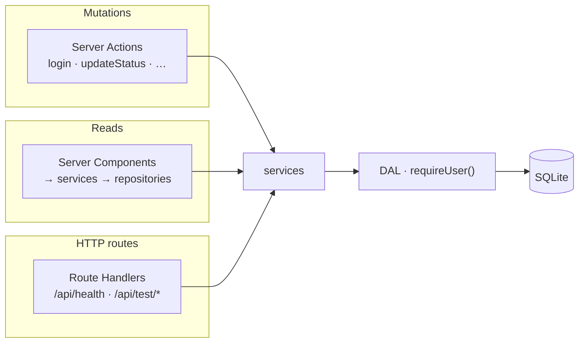

# 18 · Security Guidelines

Production-ready security standards for **As-Sunnah Desk** (the Service Request Management Portal).
These rules sit **below** [06 · Auth and security](./06-auth-and-security.md)
(architecture and decisions) and **above** individual modules (how each
endpoint is written).

Stack context: **Next.js 16 App Router**, **Server Actions**, **iron-session**,
**Drizzle ORM**, **SQLite via libSQL**, **Zod 4**, **TypeScript strict**.
Read [02 · Tech stack decisions](./02-tech-stack-decisions.md) for version pins.

---

## Purpose

This document enforces:

1. **Defence in depth** — no single layer (proxy, UI, framework) is trusted alone.
2. **Secure by default** — new code follows the same patterns without re-deciding.
3. **Fail closed** — missing auth, validation, or permission checks reject the request.
4. **Least privilege** — users, queries, and return values expose only what is needed.
5. **Observable failures** — security events are logged; user-facing errors stay generic.

If a rule here conflicts with a shortcut in implementation, **the rule wins**.
Update the code.

Architecture rationale (sessions, DAL, CSP trade-offs, rate limiting) lives in
[06](./06-auth-and-security.md). This document is the **engineering checklist**
for applying those decisions consistently.

---

## Threat model

| Dimension        | Assumption                                                                                  |
| ---------------- | ------------------------------------------------------------------------------------------- |
| Application type | Authenticated internal tool — not public marketing, not UGC-heavy                           |
| Users            | Staff with assigned roles; no self-registration                                             |
| Network          | HTTPS in production; local HTTP in development                                              |
| Attackers        | Curious insiders, stolen session cookies, direct `POST` to Server Actions or Route Handlers |
| Out of scope     | Nation-state adversaries, DDoS at scale, hardware key exfiltration                          |

**Implication:** the highest-probability risks are **broken access control**,
**insecure direct object references**, **sensitive data in the RSC payload**, and
**missing input validation** — not advanced XSS via user-generated HTML (there is
none). Design choices reflect that; a public-facing fork would tighten CSP and
add content sanitisation.

---

## Global non-negotiables

These apply to **every** read, write, and configuration change.

### 1 · Authorization lives next to the data

| Layer                                               | Role                           | Security weight             |
| --------------------------------------------------- | ------------------------------ | --------------------------- |
| `proxy.ts`                                          | Redirect convenience           | **Not** a security boundary |
| Page / layout                                       | UX — hide controls             | **Not** a security boundary |
| Data Access Layer (`requireUser`, `getCurrentUser`) | Session → live user            | **Security boundary**       |
| Service layer                                       | Capability + query scoping     | **Security boundary**       |
| Repository                                          | Narrow DTOs, parameterised SQL | **Security boundary**       |

Every Server Action and Route Handler calls `requireUser()` (or equivalent) and
checks `can(user, capability)` **before** any database work. UI permission
checks are presentation only.

See [06 · Defence layers](./06-auth-and-security.md#defence-layers).

### 2 · Identity never comes from the client payload

```ts
// ❌ Forbidden — client can impersonate any user
const { actorId, requestId, status } = parsed.data
await updateStatus(actorId, requestId, status)

// ✅ Required — identity from session only
const auth = await requireUser()
if (!auth.ok) return auth
await requestService.updateStatus(auth.data, parsed.data)
```

`userId`, `role`, `email`, and `assigneeId` for "current user" operations must
always be derived from `auth.data`, never from `input`.

### 3 · Validate before authenticate before authorize before execute

Server Action preamble order is fixed:

1. **Validate** input with Zod (`safeParse` on `unknown`).
2. **Authenticate** via `requireUser()`.
3. **Authorize** via `can(user, capability)`.
4. **Execute** in the service layer.

Malformed payloads must not touch the session layer. Unauthorized users must not
trigger service or repository work.

### 4 · `server-only` on every server module

Every file under `server/` starts with:

```ts
import 'server-only'
```

A mistaken client import becomes a **build error**, not a runtime secret leak.

### 5 · Narrow DTOs — assume the RSC payload is public

Anything returned from a Server Component or Server Action is serialised to the
browser. Repositories **select explicit columns**; `password_hash`, internal
flags, and audit-only fields never appear in return types.

```ts
// ❌ Forbidden — spreads entire row into RSC payload
return { ...user }

// ✅ Required — explicit shape
return { id: user.id, name: user.name, email: user.email, role: user.role }
```

### 6 · No secrets in source, logs, cache keys, or error responses

| Surface           | Rule                                                                         |
| ----------------- | ---------------------------------------------------------------------------- |
| Source code       | No API keys, passwords, or `SESSION_PASSWORD` literals                       |
| `.env*`           | Gitignored; only `.env.example` with placeholder names                       |
| Logs              | Never log passwords, session tokens, or full request bodies with credentials |
| Cache tags / keys | Key on opaque ids — never emails, tokens, or PII                             |
| Client errors     | `Result` with stable `code` — no stack traces, SQL, or paths                 |

### 7 · Parameterised queries only

Drizzle binds all parameters. **No** string-built SQL, **no** dynamic column
names from URL input. Sort and filter fields map through a `const` whitelist.

---

## OWASP Top 10 — project mapping

| Risk                          | How this app addresses it                                                  | Where to verify                                                                          |
| ----------------------------- | -------------------------------------------------------------------------- | ---------------------------------------------------------------------------------------- |
| A01 Broken access control     | DAL + capability checks + query scoping                                    | [06](./06-auth-and-security.md#authorization), service tests                             |
| A02 Cryptographic failures    | Argon2 passwords, iron-session sealed cookies, `SESSION_PASSWORD` from env | [06 · Sessions](./06-auth-and-security.md#sessions)                                      |
| A03 Injection                 | Drizzle parameterisation, Zod validation, sort whitelist                   | This doc § Input validation                                                              |
| A04 Insecure design           | State machine, idempotency, optimistic concurrency                         | [07](./07-mutations-and-client-state.md)                                                 |
| A05 Security misconfiguration | Security headers in `next.config.ts`, env validation at startup            | [06 · CSP](./06-auth-and-security.md#content-security-policy), [15](./15-local-setup.md) |
| A06 Vulnerable components     | `pnpm audit`, lockfile, CI `verify`                                        | This doc § Dependency security                                                           |
| A07 Auth failures             | Rate-limited login, timing-safe comparison, generic errors                 | [06 · Login rate limiting](./06-auth-and-security.md#login-rate-limiting)                |
| A08 Data integrity failures   | Zod on input, version column on updates, idempotency keys                  | [07](./07-mutations-and-client-state.md)                                                 |
| A09 Logging failures          | Structured server logs; no credential logging                              | This doc § Logging                                                                       |
| A10 SSRF                      | No user-controlled outbound URLs in scope                                  | N/A for current brief                                                                    |

---

## Server entry points — the API layer

This application has **no separate backend** and **no REST API** for domain
operations. The server boundary is three entry points — not one. Security rules
apply to all three; framework protections differ by type.



| Entry point           | Used for                 | Reachable via HTTP?    | Framework CSRF                 | Auth pattern                                 |
| --------------------- | ------------------------ | ---------------------- | ------------------------------ | -------------------------------------------- |
| **Server Actions**    | All mutations            | Yes — direct `POST`    | Yes (`Origin` vs `Host`)       | `requireUser()` + `can()`                    |
| **Server Components** | All reads (list, detail) | No — RSC stream only   | N/A                            | `getCurrentUser()` / service `requireUser()` |
| **Route Handlers**    | Health + test helpers    | Yes — `GET`/`POST`/`…` | **No** — manual if cookie-auth | Per-route; see below                         |

**Rule:** business logic lives in `server/services/`. Actions, pages, and Route
Handlers are thin adapters — validate, authenticate, authorize, delegate.

Reference: [03 · System architecture](./03-system-architecture.md),
[15 · Routes reference](./15-local-setup.md#routes-reference).

### Server Component reads

Reads do not go through `route.ts`. A page calls a service; the service calls
`requireUser()` and scopes the query. **`proxy.ts` redirecting to `/login` is
not sufficient** — a forged or stale session must still fail at the DAL.

| Check                         | Where                                                    |
| ----------------------------- | -------------------------------------------------------- |
| Session resolved to live user | `getCurrentUser()` (pages) or `requireUser()` (services) |
| Capability enforced           | Service layer before repository                          |
| Query scoped by role          | SQL `WHERE`, not post-filter                             |
| URL `searchParams` validated  | Page parses; service receives typed filters              |
| Return shape narrow           | Repository DTO — no `password_hash` in RSC payload       |

`params` and `searchParams` are **Promises** in Next.js 16 — await and validate
before passing to services. Segment values (e.g. request `reference`) are
untrusted strings; resolve to an internal id in the repository, never trust the
client to supply a surrogate UUID for authorization.

### Route Handlers (`route.ts`)

Route Handlers are **real HTTP endpoints**. They do **not** inherit Server
Action protections (no encrypted action IDs, no automatic CSRF, no `POST`-only
default for custom methods).

**When to use in this project**

| Route         | Auth      | Allowed methods | Notes                                        |
| ------------- | --------- | --------------- | -------------------------------------------- |
| `/api/health` | Public    | `GET` only      | No DB, no env details, no stack traces       |
| `/api/test/*` | Test-only | As needed       | **Must not exist in production** — see below |

Do **not** add `app/api/requests/**` CRUD routes. Mutations belong in Server
Actions; reads belong in Server Components. A Route Handler duplicates the DAL
and invites a second, unprotected API surface.

**Required handler template**

```ts
// app/api/example/route.ts
import { NextRequest } from 'next/server'
import { z } from 'zod'
import { requireUser } from '@/server/auth/dal'
import { can } from '@/server/auth/permissions'

const bodySchema = z.object({ id: z.string().uuid() }).strict()

export async function POST(req: NextRequest) {
  // 1. Validate body
  const contentType = req.headers.get('content-type') ?? ''
  if (!contentType.includes('application/json')) {
    return Response.json({ error: 'Unsupported Media Type' }, { status: 415 })
  }

  let json: unknown
  try {
    json = await req.json()
  } catch {
    return Response.json({ error: 'Invalid JSON' }, { status: 400 })
  }

  const parsed = bodySchema.safeParse(json)
  if (!parsed.success) {
    return Response.json({ error: 'Validation failed' }, { status: 422 })
  }

  // 2. Authenticate
  const auth = await requireUser()
  if (!auth.ok) {
    return Response.json({ error: 'Unauthorized' }, { status: 401 })
  }

  // 3. Authorize
  if (!can(auth.data, 'request:update:status')) {
    return Response.json({ error: 'Forbidden' }, { status: 403 })
  }

  // 4. Execute — delegate to service; return narrow JSON only
  const result = await exampleService.run(auth.data, parsed.data)
  if (!result.ok) {
    return Response.json(
      { code: result.error.code },
      { status: mapCodeToStatus(result.error.code) },
    )
  }
  return Response.json(result.data)
}

// Do not export PUT, PATCH, DELETE unless explicitly required.
```

**Route Handler rules**

| Rule                        | Detail                                                                                                                      |
| --------------------------- | --------------------------------------------------------------------------------------------------------------------------- |
| Export only needed methods  | Omitted methods return `405` automatically                                                                                  |
| Validate `params`           | `const { id } = await ctx.params` then Zod — same as URL filters                                                            |
| Validate `Content-Type`     | Reject non-JSON bodies on `POST`/`PUT`/`PATCH` with `415`                                                                   |
| Safe `req.json()`           | Wrap in `try/catch`; return `400`, never leak parse errors                                                                  |
| Cookie-auth `POST`          | No framework CSRF — use session + `sameSite: 'lax'` and same-origin fetches only; for cross-origin, add explicit CSRF token |
| No secrets in responses     | Health returns `{ status: 'ok' }` — not version, env, or DB state                                                           |
| No user data in `GET` cache | Under Cache Components, user-specific `GET` handlers must read `cookies()` inside a dynamic path or skip caching            |
| Delegate to services        | Never query `server/db` directly from `route.ts`                                                                            |
| Status codes                | `401` unauthenticated, `403` forbidden, `404` not found / out of scope, `422` validation, `429` rate limited                |

**Public health route**

`/api/health` is excluded from `proxy.ts` auth redirect
([06 · proxy matcher](./06-auth-and-security.md#the-proxy-layer)). Keep it
minimal:

```ts
export async function GET() {
  return Response.json({ status: 'ok' })
}
```

Forbidden: database pings, dependency versions, `process.env` keys, memory stats,
or anything that helps an attacker map the deployment.

**Test-only routes (`/api/test/*`)**

E2E tests bootstrap sessions via `/api/test/session` ([16 · Test
guidelines](./16-test-guidelines.md)). These routes are a **high-risk surface**
if they ship to production.

| Requirement       | Implementation                                                                                               |
| ----------------- | ------------------------------------------------------------------------------------------------------------ |
| Compile-time gate | Route files live under a `test`-only path or export `GET`/`POST` only when `process.env.NODE_ENV === 'test'` |
| Production build  | `next build` must not register `/api/test/*` — verify with `curl` against the production server              |
| No bypass of DAL  | Test session route still uses real `createSession()` — it does not mint arbitrary roles                      |
| Narrow scope      | Session bootstrap and fixture seeding only — no arbitrary SQL or admin impersonation                         |

Add an integration test or CI step that asserts `GET /api/test/session` returns
`404` on the production build artefact.

### Deployment — `serverActions.allowedOrigins`

Server Action CSRF compares `Origin` to `Host`. In production behind a custom
domain or preview URL, mismatches cause silent `403` on mutations.

```ts
// next.config.ts (when deploying to a known host)
const nextConfig = {
  serverActions: {
    allowedOrigins: ['portal.example.org', '*.preview.example.org'],
  },
}
```

Local development (`localhost`) needs no entry. Add origins only for deployed
hosts — never use `'*'`.

---

## Next.js 16 — framework-specific rules

### Server Actions are public HTTP endpoints

Treat every `'use server'` export as a `POST` route reachable without the UI:

| Framework protection      | Automatic?         | Your responsibility             |
| ------------------------- | ------------------ | ------------------------------- |
| `POST`-only invocation    | Yes                | —                               |
| CSRF (`Origin` vs `Host`) | Yes                | —                               |
| Encrypted action IDs      | Yes                | —                               |
| 1 MB body limit           | Yes (configurable) | Keep payloads small             |
| Authentication            | **No**             | `requireUser()` in every action |
| Authorization             | **No**             | `can()` + service scoping       |
| Input validation          | **No**             | Zod `safeParse`                 |
| Return value safety       | **No**             | Narrow `Result` types           |

Reference: [13 · Server Actions](./13-nextjs-16-reference.md).

### `cookies()` constraints

- `cookies()` is **async** in Next.js 16 — no sync fallback.
- `.set()` and `.delete()` are legal only in **Server Actions** and **Route
  Handlers** — never during a Server Component render.
- Session cookies: `httpOnly`, `sameSite: 'lax'`, `secure` in production only.

### `proxy.ts` is not a security gate

- No database calls in the proxy (runs on every request including prefetches).
- Matcher changes can exclude paths — **never** rely on proxy for mutation auth.
- The DAL closes any gap the proxy leaves.

### Cache Components and secrets

- Never cache a function whose return value includes data the current user must
  not see. Use `'use cache: private'` with `cacheLife` only for per-user reads
  that already passed `getCurrentUser()`.
- Cache tag values are stored **in plain text** — use opaque ids only.
- Route Handler `GET` that reads `cookies()` is dynamic — do not prerender
  user-specific JSON responses.

---

## Input validation

### Zod at every boundary

```ts
// schemas/request.schema.ts
export const updateStatusSchema = z.object({
  id: z.string().uuid(),
  status: z.enum(REQUEST_STATUSES),
  version: z.number().int().nonnegative(),
  idempotencyKey: z.string().uuid(),
})

// actions/request.actions.ts
const parsed = updateStatusSchema.safeParse(input)
if (!parsed.success) {
  return err({ code: 'VALIDATION', fields: parsed.error.flatten().fieldErrors })
}
```

| Rule                 | Detail                                                  |
| -------------------- | ------------------------------------------------------- |
| Parse `unknown`      | Never trust TypeScript types on wire data               |
| Reject unknown keys  | Use `.strict()` on object schemas when shape is fixed   |
| Bounded strings      | `.max(n)` on every string field                         |
| Bounded arrays       | `.max(n)` on filter id lists                            |
| Enums over free text | Status, priority, role — never pass raw strings to SQL  |
| No `z.any()`         | If shape is truly dynamic, validate a narrower envelope |

### URL search params

Search, sort, page, and filter state in the URL are **untrusted input**:

- Page size: whitelist (`25 | 50 | 100`), not arbitrary integers.
- Sort column: map through `SORT_COLUMNS` const — URL value never becomes a
  column identifier.
- Cursor: opaque base64; decode and validate structure before use.
- Free-text search: length cap; pass to FTS as bound parameter.

### File uploads

Not in scope for this brief. If added later:

- Whitelist MIME type **and** extension.
- Enforce max size server-side (not client-only).
- Store outside web root; serve through authenticated Route Handler.
- Never use user-supplied filename in storage path.

---

## XSS prevention

React escapes interpolated text by default. This application's XSS posture is
**prevention at source**, not sanitisation libraries.

| Allowed                     | Forbidden                                              |
| --------------------------- | ------------------------------------------------------ |
| `{user.name}` in JSX        | `dangerouslySetInnerHTML`                              |
| shadcn / Base UI components | Inline `onClick={...}` in server-rendered HTML strings |
| `next/link` for navigation  | `eval`, `new Function`, dynamic `<script>` injection   |
| Lucide icons as components  | Rendering raw HTML from database fields                |

> **Decision — no DOMPurify in this codebase.**
>
> There is no user-generated rich text. Adding `dangerouslySetInnerHTML` requires
> an explicit security review and a sanitisation dependency.
>
> **Rejected:** sanitising as a blanket policy without a rendering need — it
> adds dependency surface and false confidence.

CSP and security headers: [06 · Content Security Policy](./06-auth-and-security.md#content-security-policy).

---

## CSRF

Server Actions: framework compares `Origin` to `Host` — **do not disable**.

Session cookies use `sameSite: 'lax'` — sufficient for this app's mutation
model. Route Handlers that accept `POST` from forms must either use the same
cookie model or verify CSRF explicitly.

**Do not** store session tokens in `localStorage` or `sessionStorage`.

---

## Authorization patterns

### Capability checks

```ts
if (!can(auth.data, 'request:update:status')) {
  return err({ code: 'FORBIDDEN' })
}
```

Capabilities are defined in `server/auth/permissions.ts`. Adding a new operation
means adding a capability **and** mapping it to roles **and** checking it in
the action **and** scoping the service query.

### Query scoping — not post-filtering

```ts
// ❌ Forbidden — leaks existence via counts; breaks pagination
const all = await repo.listPaged(filters)
return all.filter((r) => r.assigneeId === user.id)

// ✅ Required — unauthorized rows never read
const scoped = can(user, 'request:read:all') ? filters : { ...filters, assigneeIds: [user.id] }
return await repo.listPaged(scoped)
```

### Direct object reference

Every read and write by id must verify the caller may access **that** record:

- Agents: `assignee_id = auth.data.id`.
- Admin / manager / viewer: role capability permits the operation.
- Return `404` (not `403`) when the record exists but is out of scope — avoids
  confirming existence to unauthorized callers. Use consistent policy in service
  layer.

---

## Authentication hardening

| Practice            | Implementation                                                                              |
| ------------------- | ------------------------------------------------------------------------------------------- |
| Password hashing    | `@node-rs/argon2` — never bcrypt for new code in this repo                                  |
| Login rate limit    | Sliding window per `hash(IP + email)` — [06](./06-auth-and-security.md#login-rate-limiting) |
| Timing-safe login   | Always run Argon2 verify; use dummy hash when email missing                                 |
| Generic login error | Always "Invalid email or password" — no account enumeration                                 |
| Session contents    | User id + expiry only — role always from DB                                                 |
| Logout              | `deleteSession()` clears cookie on current device                                           |

---

## Secrets and environment

### `server/env.ts` — fail at startup

```ts
const envSchema = z.object({
  SESSION_PASSWORD: z.string().min(32),
  DATABASE_URL: z.string().min(1),
  // ...
})
export const env = envSchema.parse(process.env)
```

Missing or weak `SESSION_PASSWORD` must crash the process on boot, not at first
login.

### Environment file rules

| File              | Committed? | Contents                                   |
| ----------------- | ---------- | ------------------------------------------ |
| `.env.example`    | Yes        | Variable **names** and descriptions only   |
| `.env.local`      | **Never**  | Real secrets for local dev                 |
| `.env.production` | **Never**  | Production values live in hosting platform |

### `SESSION_PASSWORD` requirements

- Minimum 32 characters of entropy.
- Generate with `openssl rand -base64 32` — not a memorable password.
- Rotate by invalidating all sessions (users re-login).

---

## Security headers

Configured in `next.config.ts` for all routes. Do not remove or weaken without
documented decision in [06](./06-auth-and-security.md#content-security-policy).

| Header                            | Purpose                                     |
| --------------------------------- | ------------------------------------------- |
| `Content-Security-Policy`         | Restrict script, style, frame, form targets |
| `X-Content-Type-Options: nosniff` | Block MIME sniffing                         |
| `X-Frame-Options: DENY`           | Clickjacking                                |
| `Referrer-Policy`                 | Limit referrer leakage                      |
| `Permissions-Policy`              | Disable unused browser APIs                 |
| `Strict-Transport-Security`       | HTTPS enforcement (production)              |

**Do not** add `'unsafe-eval'` to `script-src`. If a dependency requires it,
that is a blocker — find an alternative.

---

## Rate limiting

| Endpoint            | Limit                      | Key                |
| ------------------- | -------------------------- | ------------------ |
| Login               | 5 / 15 min                 | `hash(IP + email)` |
| Expensive mutations | Consider per-user throttle | `userId`           |

In-memory limiter is acceptable for this deliverable. The seam is
`checkLoginAttempt()` — swap implementation, not call sites, for Redis/Upstash
in production.

Return `429` with `Retry-After` semantics in Route Handlers; return structured
`err({ code: 'RATE_LIMITED' })` in Server Actions.

---

## Logging and error handling

### Server logs (detailed)

```ts
console.error('[updateStatus] conflict', { requestId, userId: auth.data.id })
```

Include correlation ids and user ids for audit. **Never** log passwords, session
cookie values, or full Zod payloads containing credentials.

### Client responses (generic)

```ts
// ✅ Stable codes the UI can branch on
return err({ code: 'FORBIDDEN' })
return err({ code: 'VALIDATION', fields: { status: ['Invalid status'] } })

// ❌ Forbidden — leaks internals
return err({ code: 'ERROR', message: error.stack })
return err({ code: 'ERROR', message: 'UNIQUE constraint failed: ...' })
```

### `notFound()` vs `forbidden()`

Use `notFound()` for missing or out-of-scope resources. `forbidden()` /
`unauthorized()` require `experimental.authInterrupts` — not enabled in this
project. Authorization failures in pages use redirect or inline error states.

---

## Dependency security

### CI and local commands

```bash
pnpm audit --audit-level=moderate
pnpm outdated          # review, do not blind-upgrade majors
```

`pnpm verify` in CI includes build and tests — a compromised package that breaks
build or behaviour should fail the pipeline.

### Upgrade policy

| Severity        | Action                                       |
| --------------- | -------------------------------------------- |
| Critical / High | Patch within the same sprint; document in PR |
| Moderate        | Patch before release tag                     |
| Low             | Batch in scheduled maintenance               |

### Lockfile

- `pnpm-lock.yaml` is **always** committed.
- CI uses `pnpm install --frozen-lockfile`.
- Do not hand-edit the lockfile.

### Supply chain hygiene

- Prefer well-maintained packages already in [02 · Tech stack](./02-tech-stack-decisions.md).
- Run `pnpm knip` — dead dependencies are attack surface.
- Review new dependencies in PR description: why, alternatives rejected, license.

---

## Security testing

Strategy overview: [09 · Testing strategy](./09-testing-strategy.md).
Engineering standards: [16 · Test guidelines](./16-test-guidelines.md).

### Required test categories

| Category                   | Example                                             | Layer            |
| -------------------------- | --------------------------------------------------- | ---------------- |
| Unauthenticated mutation   | Agent action without session → `UNAUTHENTICATED`    | Integration      |
| Wrong role                 | Viewer calls `updateStatus` → `FORBIDDEN`           | Integration      |
| Query scoping              | Agent `listRequests` returns only assigned rows     | Integration      |
| IDOR                       | Agent updates another agent's request → failure     | Integration      |
| Validation                 | Malformed UUID → `VALIDATION`                       | Unit             |
| State machine              | `closed → in_progress` → `INVALID_TRANSITION`       | Integration      |
| Login rate limit           | 6th attempt within window → blocked                 | Integration      |
| E2E auth boundary          | Unauthenticated `/requests` → redirect to login     | E2E              |
| Route Handler auth         | `POST` without session → `401`                      | Integration      |
| Test routes absent in prod | `GET /api/test/session` → `404` on production build | Integration / CI |
| Health route leakage       | `/api/health` returns only `{ status: 'ok' }`       | Unit             |

### What not to mock for security tests

- `requireUser` — test the real session + DAL path in integration tests.
- Repository list scoping — use real SQLite with seeded users of each role.

### Optional hardening (recommended before production)

- `jest-axe` on login and request detail forms ([08](./08-ui-states-and-accessibility.md)).
- OWASP ZAP or `nuclei` against staging — manual pass documented in release notes.

---

## Pull request security checklist

Every PR that touches auth, mutations, data access, config, or dependencies must
confirm:

| #   | Check                                                                              |
| --- | ---------------------------------------------------------------------------------- |
| 1   | Server Action / Route Handler has validate → auth → authorize → execute            |
| 2   | No identity fields taken from client `input`                                       |
| 3   | New capability added to `CAPABILITIES` and checked in action + service             |
| 4   | Repository returns narrow DTO — no spread of full row                              |
| 5   | New `server/` file has `import 'server-only'`                                      |
| 6   | Zod schema with bounds; `safeParse` on `unknown`                                   |
| 7   | Sort/filter URL params go through whitelist                                        |
| 8   | No `dangerouslySetInnerHTML`, `eval`, or inline event handlers                     |
| 9   | No secrets, `.env` values, or PII in logs or error messages                        |
| 10  | Integration test for unauthorized / wrong-role path                                |
| 11  | `pnpm audit` clean or documented exception                                         |
| 12  | Security headers unchanged or update documented in [06](./06-auth-and-security.md) |
| 13  | New Route Handler: method allowlist, `Content-Type` check, no direct DB access     |
| 14  | `/api/test/*` gated to `NODE_ENV=test` only; verified absent in prod build         |
| 15  | No new `app/api/**` domain CRUD — mutations stay Server Actions                    |

---

## Anti-patterns catalog

| Anti-pattern                             | Risk                                   | Fix                                     |
| ---------------------------------------- | -------------------------------------- | --------------------------------------- |
| Auth check only in `page.tsx`            | Direct `POST` bypasses UI              | `requireUser()` in action               |
| `actorId` in mutation payload            | Impersonation                          | Session-only identity                   |
| `SELECT *` in repository                 | RSC payload leak                       | Explicit column select                  |
| Post-filter for agent scope              | IDOR via pagination/counts             | Scope in SQL `WHERE`                    |
| `cookies().set()` in Server Component    | Build/runtime error + wrong layer      | Move to action                          |
| DB query in `proxy.ts`                   | DoS via prefetch amplification         | Cookie check only                       |
| Dynamic SQL column from URL              | Injection                              | `SORT_COLUMNS` whitelist                |
| `localStorage` session token             | XSS → account takeover                 | `httpOnly` cookie                       |
| Skipping Argon2 on unknown email         | Account enumeration                    | Dummy hash always                       |
| `console.log(input)` on login action     | Password in logs                       | Log outcome only                        |
| Trusting `role` from cookie              | Stale permissions after demotion       | DB lookup in DAL                        |
| Caching public data with user PII in tag | Cache poisoning / leak                 | Opaque id tags                          |
| REST `route.ts` for domain CRUD          | Second API surface without action CSRF | Server Actions + services               |
| Assuming Route Handler CSRF like Actions | Cross-site POST with session cookie    | Same-origin only or explicit CSRF token |
| `/api/health` returns DB/env details     | Information disclosure                 | `{ status: 'ok' }` only                 |
| `/api/test/*` in production build        | Arbitrary session / data seeding       | `NODE_ENV=test` gate + CI check         |
| Read auth only in `proxy.ts`             | Unauthenticated RSC data path          | `requireUser()` in service layer        |
| `req.json()` without try/catch           | 500 + stack leak                       | Return `400` on parse failure           |

---

## Incident and vulnerability response

### Severity guide

| Level | Example                                      | Response                        |
| ----- | -------------------------------------------- | ------------------------------- |
| P0    | Active exploit, credential leak, auth bypass | Fix immediately; rotate secrets |
| P1    | Confirmed vulnerability, no known exploit    | Patch within 24 hours           |
| P2    | Defence-in-depth gap, low exploitability     | Scheduled fix                   |
| P3    | Hardening suggestion                         | Backlog                         |

### Fix workflow

1. **Contain** — disable affected endpoint or rotate compromised secret.
2. **Patch** — minimal fix with regression test proving the hole is closed.
3. **Verify** — `pnpm verify`; add integration test for the attack vector.
4. **Document** — update [06](./06-auth-and-security.md) if architecture changes;
   update this doc if a new rule prevents recurrence.
5. **Retrofit** — grep for the same pattern elsewhere (`grep -r` / code review).

### Secret rotation

If `SESSION_PASSWORD` is exposed:

1. Generate new password (`openssl rand -base64 32`).
2. Deploy with new value — all existing sessions invalidate (users re-login).
3. Audit logs for suspicious activity in the exposure window.

---

## Pre-release security gate

Before tagging a release or submitting the assessment:

```bash
pnpm verify
pnpm audit --audit-level=moderate
```

| Gate         | Pass criteria                                                             |
| ------------ | ------------------------------------------------------------------------- |
| Build        | `pnpm build` succeeds with `cacheComponents: true`                        |
| Tests        | Auth, IDOR, and role tests green                                          |
| Audit        | No unmitigated high/critical CVEs in dependencies                         |
| Headers      | Security headers present on `/` and `/login` (browser DevTools → Network) |
| Cookies      | `asf_session` is `HttpOnly`, `SameSite=Lax`                               |
| Env          | App refuses to start without valid `SESSION_PASSWORD`                     |
| Secrets      | `git log -p` contains no `.env` or password literals                      |
| Test routes  | `/api/test/*` returns `404` on production server                          |
| Health route | `/api/health` exposes no internals                                        |

---

## Related documents

| Document                                                              | Relationship                                        |
| --------------------------------------------------------------------- | --------------------------------------------------- |
| [06 · Auth and security](./06-auth-and-security.md)                   | Architecture: sessions, DAL, CSP, rate limiting     |
| [07 · Mutations and client state](./07-mutations-and-client-state.md) | Idempotency, concurrency, state machine             |
| [09 · Testing strategy](./09-testing-strategy.md)                     | What security scenarios are tested                  |
| [13 · Next.js 16 reference](./13-nextjs-16-reference.md)              | Framework API facts (async cookies, Server Actions) |
| [15 · Local setup](./15-local-setup.md)                               | Env vars, test credentials                          |
| [16 · Test guidelines](./16-test-guidelines.md)                       | How to write security integration tests             |
